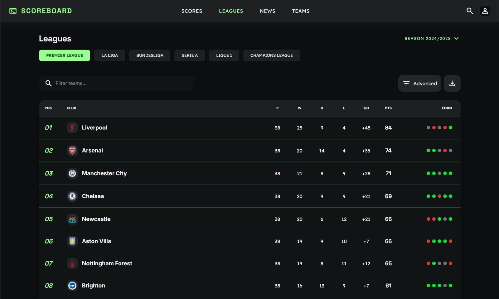
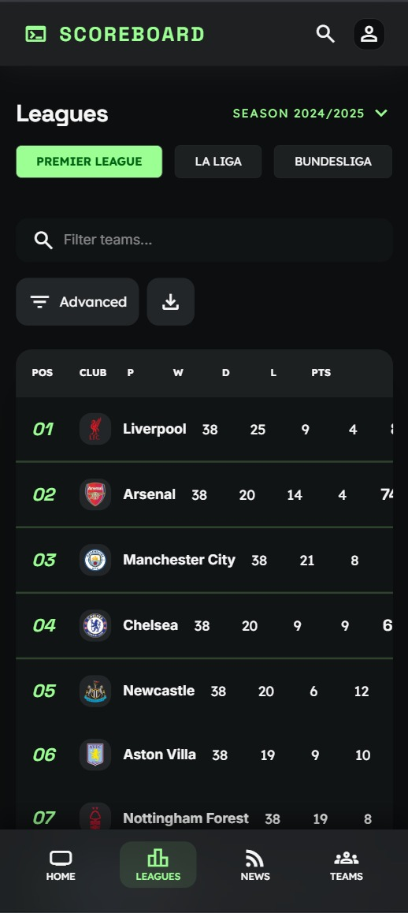

# ⚡ ScoreBoard — Live Football Scoreboard

> A real-time football scoreboard with a sleek dark UI aesthetic. Track live matches, standings, team stats, and player statistics across top European leagues.



## ✨ Features

### Live Match Tracking

- **Real-time scores** with live match status indicators
- **Match details** including events, lineups, statistics, and head-to-head records
- **Auto-refresh** with smart caching to minimize API calls

### League Standings

- **Complete league tables** for Premier League, La Liga, Bundesliga, Serie A, Ligue 1, and Champions League
- **Form indicators** showing recent team performance
- **Sortable statistics** — points, wins, draws, losses, goal difference

### Team & Player Stats

- **Team profiles** with squad information and venue details
- **Player statistics** including top scorers and assists
- **Recent match history** for every team

### Progressive Web App

- **Installable** on desktop and mobile devices
- **Offline-capable** with cached data
- **Responsive design** — native feel on any screen size



## 🛠️ Tech Stack

### Frontend

| Library            | Purpose                         |
| ------------------ | ------------------------------- |
| **Next.js 16**     | React framework with App Router |
| **Tailwind CSS 4** | Utility-first styling           |
| **shadcn/ui**      | Accessible component primitives |
| **TanStack Query** | Async state management          |
| **tRPC**           | End-to-end type-safe API calls  |

### Backend

| Library            | Purpose                             |
| ------------------ | ----------------------------------- |
| **Hono**           | Lightweight API server              |
| **tRPC**           | Type-safe API layer                 |
| **Drizzle ORM**    | TypeScript-first database ORM       |
| **SQLite + Turso** | Local database with edge deployment |
| **Better-Auth**    | Authentication framework            |

### Developer Experience

| Library          | Purpose                        |
| ---------------- | ------------------------------ |
| **TypeScript**   | Full type safety               |
| **Bun**          | Fast runtime & package manager |
| **Turborepo**    | Monorepo build optimization    |
| **Biome**        | Linting & formatting           |
| **API-Football** | Football data provider         |

## 🚀 Getting Started

### Prerequisites

- [Bun](https://bun.sh) runtime
- API key from [API-Football](https://api-football.com/)

### Installation

```bash
# Clone the repository
git clone https://github.com/yourusername/scoreboard.git
cd scoreboard

# Install dependencies
bun install

# Configure environment
cp apps/server/.env.example apps/server/.env
# Add your API_FOOTBALL_KEY to apps/server/.env

# Push database schema
bun run db:push

# Start development servers
bun run dev
```

### Environment Variables

Create `apps/server/.env`:

```env
BETTER_AUTH_SECRET=your-32-char-secret
BETTER_AUTH_URL=http://localhost:3000
CORS_ORIGIN=http://localhost:3001
DATABASE_URL=file:../../local.db
API_FOOTBALL_KEY=your-api-key
```

## 📁 Project Structure

```
scoreboard/
├── apps/
│   ├── web/              # Next.js frontend (port 3001)
│   │   ├── src/
│   │   │   ├── app/     # App Router pages
│   │   │   ├── components/  # Page-specific components
│   │   │   └── utils/   # Client utilities
│   │   └── public/      # Static assets
│   └── server/          # Hono API server (port 3000)
│       ├── src/
│       │   ├── index.ts # Server entry point
│       │   └── cache/   # Disk cache for API responses
│       └── .cache/      # Cached API responses
├── packages/
│   ├── api/             # tRPC routers & business logic
│   │   └── src/
│   │       ├── routers/ # API endpoints
│   │       └── lib/     # API client & caching
│   ├── auth/            # Better-Auth configuration
│   ├── db/              # Drizzle schema & queries
│   ├── env/             # Environment validation
│   └── ui/              # Shared shadcn/ui components
└── assets/              # Screenshots & images
```

## 🔌 API Endpoints

The tRPC API provides:

| Endpoint                    | Description                   |
| --------------------------- | ----------------------------- |
| `football.liveFixtures`     | All currently live matches    |
| `football.standings`        | League standings by season    |
| `football.fixturesByLeague` | Fixtures by league and season |
| `football.fixtureById`      | Single match details          |
| `football.teamById`         | Team information              |
| `football.teamSquad`        | Team squad/roster             |
| `football.topScorers`       | Top scorers by league         |
| `football.popularLeagues`   | Top European leagues          |

## 💾 Caching Strategy

To optimize API usage (100 requests/day on free tier), all responses are cached to disk:

| Data Type     | Cache TTL  |
| ------------- | ---------- |
| Live Fixtures | 15 seconds |
| Fixtures      | 60 seconds |
| Standings     | 1 hour     |
| Teams         | 24 hours   |
| Leagues       | 24 hours   |
| Player Stats  | 6 hours    |

## 🎨 Design System

**ScoreBoard** theme features:

- Dark surfaces with neon green (`#9ff93`) accents
- Space Grotesk + Lexend typography
- Material Symbols icons
- Glass-morphism effects
- Smooth micro-animations

## 📦 Available Scripts

```bash
bun run dev          # Start all apps (web + server)
bun run dev:web      # Start only Next.js
bun run dev:server   # Start only API server
bun run build        # Production build
bun run check        # Format & lint
bun run check-types # TypeScript validation
bun run db:studio    # Open Drizzle Studio
```

## 📄 License

MIT License — feel free to use and modify for your own projects.
